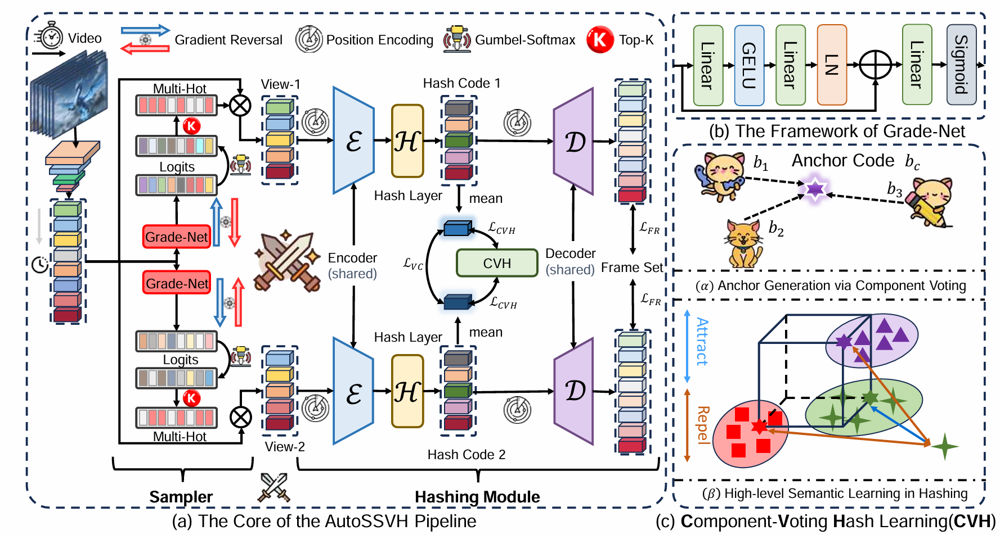

# AutoSSVH: Exploring Automated Frame Sampling for Efficient Self-Supervised Video Hashing

[toc]

## 1. Introduction

This repository contains the **PyTorch** implementation of our work at **CVPR 2025**:

> [**AutoSSVH: Exploring Automated Frame Sampling for Efficient Self-Supervised Video Hashing**](http://arxiv.org/abs/2412.14518). Niu Lian, Jun Li, Jinpeng Wang, Ruisheng Luo, Yaowei Wang, Shu-Tao Xia, Bin Chen.



We present "AutoSSVH", a novel approach in the field of self-supervised video hashing. "AutoSSVH" integrates an adversarial strategy-based sampler with Hash Voting, which accelerates adversarial convergence. Inspired by GANs, our sampler automatically selects frames that are difficult to reconstruct, thereby enhancing the semantic information of the hash codes. Hash Voting, based on ensemble learning, employs a P2Set paradigm to strengthen the neighborhood information of the hash codes. Extensive experiments demonstrate the efficiency and robustness of "AutoSSVH". We hope that our research provides valuable insights for future strategies in adversarial sampling.

In the following, we will guide you how to use this repository step by step. 🤗🐶

## 2. Preparation

```bash
git clone https://github.com/gimpong/CVPR25-AutoSSVH.git
cd CVPR25-AutoSSVH/
```

### 2.1 Requirements

- python==3.11.8
- numpy==1.26.4
- pytorch==2.0.1
- torchvision==0.15.2
- scipy==1.5.4
- h5py==3.1.0
- addict==2.4.0
- faiss==1.8.0

### 2.2 Download the video feature datasets and organize them properly

Before running the code, make sure that everything is ready. The working directory is expected to be organized as below:


<details><summary>CVPR25-AutoSSVH/</summary>
    <li>checkpoint/</li>
    <ul>
      <li>activitynet/</li>
      <ul>
          <li>AutoSSVH_16bit</li>
          <li>AutoSSVH_32bit</li>
          <li>AutoSSVH_64bit</li>
      </ul>fcv/</li>
      <ul>
          <li>AutoSSVH_16bit</li>
          <li>AutoSSVH_32bit</li>
          <li>AutoSSVH_64bit</li>
      </ul>hmdb/</li>
      <ul>
          <li>AutoSSVH_16bit</li>
          <li>AutoSSVH_32bit</li>
          <li>AutoSSVH_64bit</li>
      </ul>ucf/</li>
      <ul>
          <li>AutoSSVH_16bit</li>
          <li>AutoSSVH_32bit</li>
          <li>AutoSSVH_64bit</li>
      </ul>
    </ul>
    <li>data/</li>
    <ul>
      <li>activitynet/</li>
    	<ul>
        <li>train_feats.h5</li>
        <li>test_feats.h5</li>
        <li>re_label.mat</li>
        <li>query_feats.h5</li>
        <li>q_label.mat</li>
    	</ul>
    	<li>fcv/</li>
    	<ul>
        <li>fcv_train_feats.h5</li>
        <li>fcv_test_feats.h5</li>
        <li>fcv_test_labels.mat</li>
    	</ul>
    	<li>hmdb/</li>
    	<ul>
        <li>hmdb_train_feats.h5</li>
        <li>hmdb_train_labels.mat</li>
        <li>hmdb_test_feats.h5</li>
        <li>hmdb_test_labels.mat</li>
    	</ul>
      <li>ucf/</li>
    	<ul>
        <li>ucf_train_feats.h5</li>
        <li>ucf_train_labels.mat</li>
        <li>ucf_test_feats.h5</li>
        <li>ucf_test_labels.mat</li>
    	</ul>
    </ul>
    <li>configs/</li>
    <li>dataset/</li>
    <li>inference/</li>
    <li>Loss/</li>
    <li>model/</li>
    <li>optim/</li>
    <li>utils/</li>
    <li>preprocess.py</li>
    <li>train.py</li>
    <li>eval.py</li>
    <li>requirements.txt</li>
</ul>
</details>


You can downloaded video features from the following Baidu Cloud links and put them into dataset-specific folder under the `data/` folder.

|   Dataset   | Video Features | Logs and Checkpoints |
|:-----------:|:--------------:|:--------------------:|
| ActivityNet |   [Baidu disk](https://pan.baidu.com/s/1cDJ0-6T2-AOeLgp5rBihfA?pwd=0000)   |      [Baidu disk](https://pan.baidu.com/s/1LuLU8DmEz8jMwLbiu1Qggg?0000)      |
|    FCVID    |   [Baidu disk](https://pan.baidu.com/s/1v0qo4PtiZgFB9iLmj3sJIg?pwd=0000)   |      [Baidu disk](https://pan.baidu.com/s/1M4-z1zoaPMKMUwduPzZN2A?0000)      |
|    UCF101   |   [Baidu disk](https://pan.baidu.com/s/1c2NMC0Y8R3zn4ionzKUP4g?pwd=0000)   |      [Baidu disk](https://pan.baidu.com/s/1gcoxSY89PZx_LPRdi4nojQ?0000)      |
|    HMDB51   |   [Baidu disk](https://pan.baidu.com/s/1su2STM7b2mg-jBfsN5iRIQ?pwd=0000)   |      [Baidu disk](https://pan.baidu.com/s/1QuAS2BZ_HebAoCOeI6B6Kg?0000)      |


### 2.3 Train

The training command is as follows:

```
python train.py --config configs/AutoSSVH/AutoSSVH_<DATASET_NAME>.py --gpu <GPU_ID>
```

**Options**: 
- `<DATASET_NAME>`: `act`, `fcv`, `ucf`, `hmdb`
- `<GPU_ID>`: specify the gpu id

The logs, model checkpoints will be generated under the `logs/` and `checkpoint/` folders, respectively. 

### 2.5 Test

We provide the evaluation code for model checkpoints (if exist). 
The test command is as follows:

```
python eval.py --configs/AutoSSVH/AutoSSVH_<DATASET_NAME>.py --gpu <GPU_ID>
```


## 3. Results

<table><thead>
  <tr>
    <th colspan="2" rowspan="2">Dataset</th>
    <th rowspan="2">Code Length</th>
    <th rowspan="2">MAP@5</th>
    <th rowspan="2">MAP@20</th>
    <th rowspan="2">MAP@40</th>
    <th rowspan="2">MAP@60</th>
    <th rowspan="2">MAP@80</th>
    <th rowspan="2">MAP@100</th>
    <th rowspan="2">Log</th>
    <th rowspan="2">MAP File</th>
  </tr>
  <tr>
  </tr></thead>
<tbody>
  <tr>
    <td colspan="2" rowspan="3">ActivityNet</td>
    <td>16</td>
    <td>0.176</td>
    <td>0.091</td>
    <td>0.055</td>
    <td>0.040</td>
    <td>0.031</td>
    <td>0.026</td>
    <td><a href="checkpoint/activitynet/AutoSSVH_16bit/log.txt">ActivityNet-16bit.log</a></td>
    <td><a href="checkpoint/activitynet/AutoSSVH_16bit/map.txt">ActivityNet-16bit.map</a></td>
  </tr>
  <tr>
    <td>32</td>
    <td>0.250</td>
    <td>0.136</td>
    <td>0.082</td>
    <td>0.061</td>
    <td>0.049</td>
    <td>0.038</td>
    <td><a href="checkpoint/activitynet/AutoSSVH_32bit/log.txt">ActivityNet-32bit.log</a></td>
    <td><a href="checkpoint/activitynet/AutoSSVH_32bit/map.txt">ActivityNet-32bit.map</a></td>
  </tr>
  <tr>
    <td>64</td>
    <td>0.290</td>
    <td>0.164</td>
    <td>0.098</td>
    <td>0.071</td>
    <td>0.055</td>
    <td>0.045</td>
    <td><a href="checkpoint/activitynet/AutoSSVH_64bit/log.txt">ActivityNet-64bit.log</a></td>
    <td><a href="checkpoint/activitynet/AutoSSVH_64bit/map.txt">ActivityNet-64bit.map</a></td>
  </tr>
  <tr>
    <td colspan="2" rowspan="3">FCVID</td>
    <td>16</td>
    <td>0.347</td>
    <td>0.256</td>
    <td>0.225</td>
    <td>0.207</td>
    <td>0.193</td>
    <td>0.180</td>
    <td><a href="checkpoint/fcvid/AutoSSVH_16bit/log.txt">FCVID-16bit.log</a></td>
    <td><a href="checkpoint/fcvid/AutoSSVH_16bit/map.txt">FCVID-16bit.map</a></td>
  </tr>
  <tr>
    <td>32</td>
    <td>0.483</td>
    <td>0.336</td>
    <td>0.289</td>
    <td>0.263</td>
    <td>0.244</td>
    <td>0.228</td>
    <td><a href="checkpoint/fcvid/AutoSSVH_32bit/log.txt">FCVID-32bit.log</a></td>
    <td><a href="checkpoint/fcvid/AutoSSVH_32bit/map.txt">FCVID-32bit.map</a></td>
  </tr>
  <tr>
    <td>64</td>
    <td>0.539</td>
    <td>0.381</td>
    <td>0.334</td>
    <td>0.309</td>
    <td>0.290</td>
    <td>0.273</td>
    <td><a href="checkpoint/fcvid/AutoSSVH_64bit/log.txt">FCVID-64bit.log</a></td>
    <td><a href="checkpoint/fcvid/AutoSSVH_64bit/map.txt">FCVID-64bit.map</a></td>
  </tr>
  <tr>
    <td colspan="2" rowspan="3">UCF101</td>
    <td>16</td>
    <td>0.423</td>
    <td>0.343</td>
    <td>0.288</td>
    <td>0.244</td>
    <td>0.210</td>
    <td>0.184</td>
    <td><a href="checkpoint/ucf/AutoSSVH_16bit/log.txt">UCF101-16bit.log</a></td>
    <td><a href="checkpoint/ucf/AutoSSVH_16bit/map.txt">UCF101-16bit.map</a></td>
  </tr>
  <tr>
    <td>32</td>
    <td>0.519</td>
    <td>0.448</td>
    <td>0.396</td>
    <td>0.353</td>
    <td>0.309</td>
    <td>0.269</td>
    <td><a href="checkpoint/ucf/AutoSSVH_32bit/log.txt">UCF101-32bit.log</a></td>
    <td><a href="checkpoint/ucf/AutoSSVH_32bit/map.txt">UCF101-32bit.map</a></td>
  </tr>
  <tr>
    <td>64</td>
    <td>0.570</td>
    <td>0.500</td>
    <td>0.452</td>
    <td>0.413</td>
    <td>0.373</td>
    <td>0.329</td>
    <td><a href="checkpoint/ucf/AutoSSVH_64bit/log.txt">UCF101-64bit.log</a></td>
    <td><a href="checkpoint/ucf/AutoSSVH_64bit/map.txt">UCF101-64bit.map</a></td>
  </tr>
  <tr>
    <td colspan="2" rowspan="3">HMDB51</td>
    <td>16</td>
    <td>0.161</td>
    <td>0.113</td>
    <td>0.081</td>
    <td>0.064</td>
    <td>0.053</td>
    <td>0.045</td>
    <td><a href="checkpoint/hmdb/AutoSSVH_16bit/log.txt">HMDB51-16bit.log</a></td>
    <td><a href="checkpoint/hmdb/AutoSSVH_16bit/map.txt">HMDB51-16bit.map</a></td>
  </tr>
  <tr>
    <td>32</td>
    <td>0.227</td>
    <td>0.163</td>
    <td>0.123</td>
    <td>0.097</td>
    <td>0.081</td>
    <td>0.069</td>
    <td><a href="checkpoint/hmdb/AutoSSVH_32bit/log.txt">HMDB51-32bit.log</a></td>
    <td><a href="checkpoint/hmdb/AutoSSVH_32bit/map.txt">HMDB51-32bit.map</a></td>
  </tr>
  <tr>
    <td>64</td>
    <td>0.256</td>
    <td>0.175</td>
    <td>0.137</td>
    <td>0.111</td>
    <td>0.090</td>
    <td>0.076</td>
    <td><a href="checkpoint/hmdb/AutoSSVH_64bit/log.txt">HMDB51-64bit.log</a></td>
    <td><a href="checkpoint/hmdb/AutoSSVH_64bit/map.txt">HMDB51-64bit.map</a></td>
  </tr>
</tbody></table>


## 4. References
If you find our code useful or use the toolkit in your work, please consider citing:
```
@inproceedings{Lian25_AutoSSVH,
  author={Lian, Niu and Li, Jun and Wang, Jinpeng and Luo, Ruisheng and Wang, Yaowei and Xia, Shu-Tao and Chen, Bin},
  title={AutoSSVH: Exploring Automated Frame Sampling for Efficient Self-Supervised Video Hashing},
  booktitle={Proceedings of the AAAI Conference on Artificial Intelligence},
  year={2025}
}
```

## 5. Acknowledgements
This code is based on our previous work [ConMH](https://github.com/huangmozhi9527/ConMH) at AAAI'23. 
We are also grateful for other teams for open-sourcing codes that inspire our work, including 
[SSVH](https://github.com/lixiangpengcs/Self-Supervised-Video-Hashing), 
[BTH](https://github.com/Lily1994/BTH), 
[MCMSH](https://github.com/haoyanbin918/MCMSH), 
[BerVAE](https://github.com/wangyucheng1234/BerVAE), 
[DKPH](https://github.com/IMCCretrieval/DKPH), 
and [SHC-IR](https://github.com/Wangld5/SHC-IR).

## 6. Contact
If you have any question, you can raise an issue or email Jinpeng Wang (wjp20@mails.tsinghua.edu.cn). We will reply you soon.
# CVPR25-AutoSSVH
